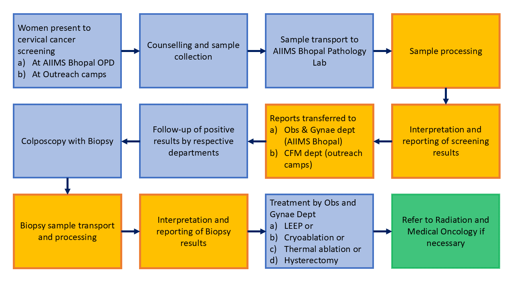

# Baseline_map_and_sim
This is the first repository created. The purpose of this repo is to make a baseline computer representation of the AIIMS Bhopal Cervical Cancer pathway and run baseline simulations using initial parameters.

Through initial discussions with the core modelling group at AIIMS Bhopal, I have made one representation of the AIIMS Bhopal Cervical Cancer system. I have a few knowns about the system. I know how patients flow and which departments are involved. I also know which people and what resources are involved in the process. I also know how the OPD and the surgery rotations are conducted and how samples are transported and processed in the laboratory. 

Known Unknowns
1) Parameters (time taken for each process)
2) Key performance indicators used for decision making.
3) Adaptations that the people within the system do to keep it from going.

Given these limitations and assumptions, I will make an initial baseline representation of the AIIMS Bhopal cervial cancer care pathway and parametrise it using available data. 

*Functionality that this app will have*
<ol>
<li> Take in all input parameters
<li> Initial baseline map of the system
<li> Will simulate for a week
<li> Will generate a graph/excel sheet of 2 KPI (%utlisation of HR, waiting time for different processes, average queue length for different processes)
<li> Will have a gradio app that can run this simulation
<li> Host this app on Hugging Face
</ol>

**Baseline Map as drawn from initial discussions**
<img src = 'AIIMS Bhopal baseline process map.png', alt = "AIIMS Bhopal baseline process map)

